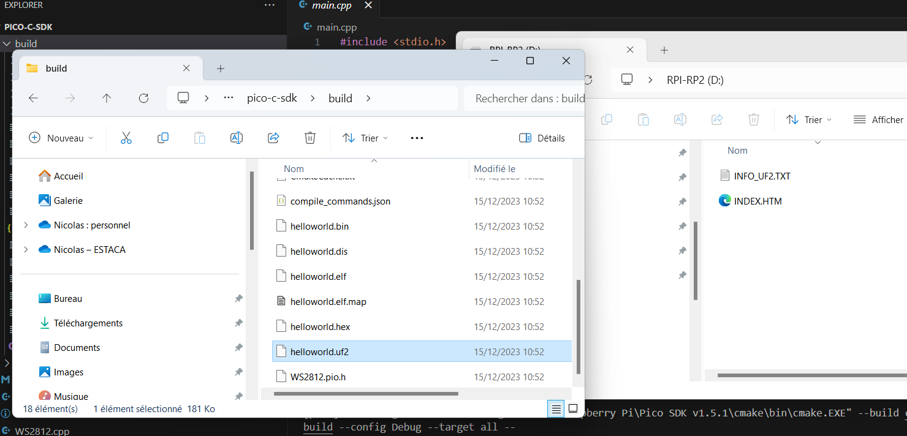

# Installer le SDK par C/C++ sur RP2040

La documentation du SDK peut être trouvé [ici](https://www.raspberrypi.com/documentation/pico-sdk/).

## Etapes d'installation

- Installer Visual Studio Code
  - Sur le [site de microsoft](https://code.visualstudio.com/download)
  - Avec WinGet: ```winget install -e --id Microsoft.VisualStudioCode```
- Installer le SDK pico avec l'[installer](https://github.com/raspberrypi/pico-setup-windows/releases/latest/download/pico-setup-windows-x64-standalone.exe) (depuis le [GitHub](https://github.com/raspberrypi/pico-setup-windows?tab=readme-ov-file))

## Utilisation

Une fois le SDK installé il suffit de lancer "PICO - Visual Studio Code" ce qui va lancer VSCode avec les liens avec le SDK déjà paramétrés.

Pour compiler le code il faut lancer la tâche build dans la bar en bas sur vscode.

> Si jamais le button n'est pas visible, vérifier d'abord que le dossier est bien ouvert et que le fichier CMakeLists.txt est bien présentà la racine. Sinon, il faut installer l'extension [CMake Tools](https://marketplace.visualstudio.com/items?itemName=ms-vscode.cmake-tools)
> La première fois il faudra sélectionner le kit. Il faut choisir le kit GCC arm avec PICO SDK dans le nom du chemin. 


Une fois le build terminé le code de sortie doit être 0 sinon c'est qu'il y a des erreurs dans le code ou un problème de configuration.

Avec l'explorateur de fichier localiser le fichier NOM_DU_PROJET.uf2, c'est ce fichier qu'il faudra envoyer sur la PICO. Pour cela il faut bancher la pico avec un cable sur l'ordinateur en maintenant le boutton "BOOT" enfoncé. La carte devrait être reconnu par l'ordinateur comme un support de stockage (clé USB). Il faut glisser/déposer le fichier uf2 dedans. Une fois le programme flashé, à chaque fois que la carte se lance elle va démander le programme.



## Exemples

Ce repos contient plusieurs codes exemples que vous pouvez réutiliser. Ils ont été développés pour RP2040 zero Wireshare, mais peuvent être facilement adapté pour d'autres cartes de développement RP2040.

### RGB wheel

Utilisation de la LED embarquée pour une animation RGB parcourant le cercle chromatique. Pour l'adressage de la LED, la librairie utilisée est : [WS2812 LED](https://github.com/ForsakenNGS/Pico_WS2812).

### SSD1306 Oled

Utilisation du microcontrolleur pour afficher une image sur un écran OLED SSD1306 avec une animation RGB parcourant le cercle chromatique sur le deuxième coeur. Pour l'adressage de la LED, la librairie utilisée est : [WS2812 LED](https://github.com/ForsakenNGS/Pico_WS2812) et pour l'utilisation de l'écran : [pico-ssd1306](https://github.com/daschr/pico-ssd1306/tree/main) (mais avec quelques modifications du code pour passer de C à CPP).

Pour changer l'image, il faut d'abord un fichier [bitmap monochrome](https://support.bradyid.com/s/article/How-to-Convert-an-Image-to-Monochrome-Bitmap), puis afin d'embarquer l'image dans le code il faut transformer le fichier bmp en [tableau c](https://sparksandflames.com/cgi-bin/blobinatorweb.cgi) et remplacer le contenu du fichier SSD1306_oled/siera_logo.hpp.

## Liens utiles

[Pour mieux comprendre CMake](https://www.youtube.com/watch?v=A735Y4kMIPM)

[Tutoriel pour faire un blink](https://www.youtube.com/watch?v=B5rQSoOmR5w)
