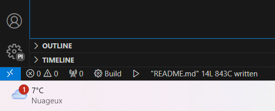
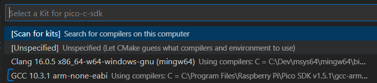

# Installer le SDK par C/C++ sur RP2040

La documentation du SDK peut être trouvé [ici](https://www.raspberrypi.com/documentation/pico-sdk/).

## Etapes d'installation
- Installer Visual Studio Code
  - Sur le [site de microsoft](https://code.visualstudio.com/download)
  - Avec WinGet: ```winget install -e --id Microsoft.VisualStudioCode```
- Installer le SDK pico avec l'[installer](https://github.com/raspberrypi/pico-setup-windows/releases/latest/download/pico-setup-windows-x64-standalone.exe) (depuis le [GitHub](https://github.com/raspberrypi/pico-setup-windows?tab=readme-ov-file))

## Utilisation
Une fois le SDK installé il suffit de lancer "PICO - Visual Studio Code" ce qui va lancer VSCode avec les liens avec le SDK déjà paramétrés.

Pour compiler le code il faut lancer la tâche build dans la bar en bas sur vscode.

> Si jamais le button n'est pas visible, vérifier d'abord que le dossier est bien ouvert et que le fichier CMakeLists.txt est bien présentà la racine. Sinon, il faut installer l'extension [CMake Tools](https://marketplace.visualstudio.com/items?itemName=ms-vscode.cmake-tools)
> La première fois il faudra sélectionner le kit. Il faut choisir le kit GCC arm avec PICO SDK dans le nom du chemin. 


Une fois le build terminé le code de sortie doit être 0 sinon c'est qu'il y a des erreurs dans le code ou un problème de configuration.

Avec l'explorateur de fichier localiser le fichier NOM_DU_PROJET.uf2, c'est ce fichier qu'il faudra envoyer sur la PICO. Pour cela il faut bancher la pico avec un cable sur l'ordinateur en maintenant le boutton "BOOT" enfoncé. La carte devrait être reconnu par l'ordinateur comme un support de stockage (clé USB). Il faut glisser/déposer le fichier uf2 dedans. Une fois le programme flashé, à chaque fois que la carte se lance elle va démander le programme.

## Exemple
Ce repos contient un programme blink exemple pour les RP2040 zero Wireshare. Il suffit de télécharger le code, puis le dézipper et ouvrir le dossier dans "PICO - Visual Studio Code" et faire les étapes expliqué dans la partie précédente. Pour l'adressage de la LED embarqué sur la carte j'utilise la librairie: [WS2812 LED](https://github.com/ForsakenNGS/Pico_WS2812)

## Liens utiles
[Pour mieux comprendre CMake](https://www.youtube.com/watch?v=A735Y4kMIPM)
[Tutoriel pour faire un blink](https://www.youtube.com/watch?v=B5rQSoOmR5w)